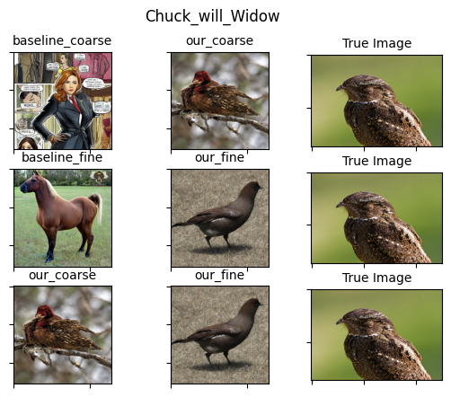
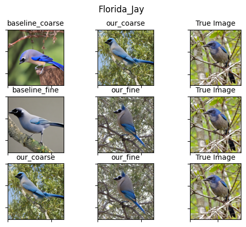
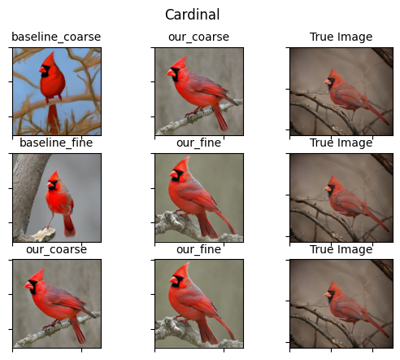
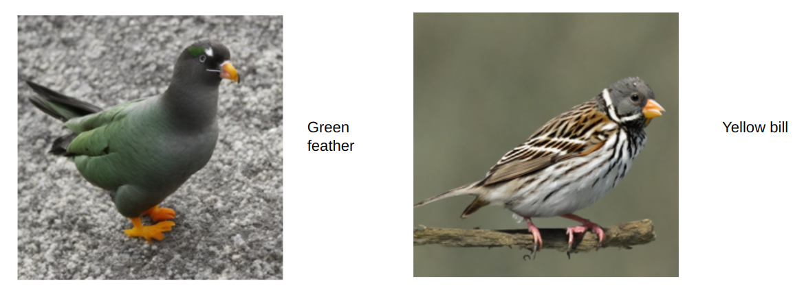

# text-to-bird
Course project for Harvard AC209B, do diffusion models dream of birds?

## Install

Simply install the python package:
```shell
pip install -r requirements.txt
```
Note that our code is tested using `torch` 2.0.0 and `diffusers` 0.16.1.

## Dataset

The dataset is [Caltech-UCSD Birds-200-2011 (CUB-200-2011)](https://www.kaggle.com/datasets/veeralakrishna/200-bird-species-with-11788-images/code), an image dataset with photos of 200 bird species (mostly North American). The total number of categories of birds is 200 and there are 11,788 images. Annotations include color, location of body parts, type of body part, bounding boxes, segmentation labels, etc. It is the most widely-used dataset for fine-grained visual categorization tasks.

The dataset is already well-cleaned, so we only need to select the data we need and merge them into a data frame. We use the [dataset](https://pypi.org/project/datasets/) package to merge the data. Our final data frame includes four columns: 'image', 'label', 'attributes', and 'split'. The ‘image’ column contains the image of the birds. The ‘attributes’ column is formatted in the one-hot encoding style: there are 312 attributes in total, such as the bird’s bill/crown/wing’s color/shape/pattern, and if the bird in the image has that attribute, then the ‘label’ would be 1 for that ‘attribute’. The ‘split’ has two values: train and test, indicating whether the image belongs to the training set or the testing set. There are 5994 rows in the training set and 5794 rows in the testing set.

To prepare dataset, download CUB Bird datasets in `dataset` folder, which will have the structure (via `tree -L 2 ${data_dir}`) as follows:
```
dataset
├── attributes.txt
└── CUB_200_2011
    ├── attributes
    ├── bounding_boxes.txt
    ├── classes.txt
    ├── image_class_labels.txt
    ├── images
    ├── images.txt
    ├── parts
    ├── README
    └── train_test_split.txt
```

## Models

In this project we use stable diffusion.

The architecture is as follows:

<p align="center">
  
</p>

    
- Given a latent Gaussian noise and a user textual prompt that undergoes CLIP text encoder.

- We input both latent noise and textual embedding onto a UNet to generate latent variable that is conditioned on text.

- The produced latent variable is then repeatedly denoise, and the end result is passed to VAE to generate image.

## Usage

In this project we explore two granualities of bird captions: (1) **coarse**: simply class name such as `American Crow` and (2) **fine**: on top of class name, caption contains detailed attributes such as `black_crown`, `black_wings`, `black_bill`, etc.
We finetune a pretrained [stable diffusion 2.1](https://huggingface.co/stabilityai/stable-diffusion-2-1) model using the two granualities of captions and compare the performance of finetuned models compared to vanilla stable diffusion 2.1.

To train a diffusion model, run:
```shell
granuality="coarse" # or "fine"
accelerate launch --mixed_precision="fp16" --gpu_ids="0" train_text_to_image_lora_cub.py \
  --pretrained_model_name_or_path="stabilityai/stable-diffusion-2-1" \
  --train_data_dir=dataset \
  --caption_column="caption" --image_column="image" \
  --resolution=512 --random_flip \
  --train_batch_size=4 --gradient_accumulation_steps=4 \
  --allow_tf32 --enable_xformers_memory_efficient_attention \
  --num_train_epochs=10 --checkpointing_steps=500 \
  --learning_rate=1e-04 --lr_scheduler="constant" --lr_warmup_steps=0 \
  --seed=42 -t $granuality \
  --output_dir="output/stabilityai/stable-diffusion-2-1/ft_lora_$granuality" \
  --validation_prompt="Mourning Warbler" --report_to="wandb"
```
which will launch training process with
- [LoRA [Hu et al 2021]](https://arxiv.org/abs/2106.09685) optimization that decomposes weights (as matrices) in the model to a matrix multiplication of two smaller matrices so that training and inference is more efficient. Moreover we use the [accelerate](https://github.com/huggingface/accelerate) library to enable parallel training using multiple GPUs.

- half precision to save more GPU memory, and we do not observe decease in image quality.

- FlashAttention [[Dao et al 2022]](https://arxiv.org/abs/2205.14135) to further accelerate training and reduce memory consumption.

- 16 total batch size and generate 512x512 image

After the training is done, we can evaluate the model using [FID](https://www.wikiwand.com/en/Fr%C3%A9chet_inception_distance) compared against ground truth images.
```shell
python eval_text_to_image.py -t coarse \ # or -t fine
  --ckpt <path_to_ckpt> -n <batch size>
```
Further we can also evaluate the vanilla stable diffusion 2.1 model using
```shell
python eval_text_to_image.py -t coarse -n <batch size>
```

## Results

We mainly compare four models, namely baseline fine/coarse and finetuned fine/coarse.

### FID
The FID scores are as follows:

|                  | FID    |
|------------------|--------|
| Baseline coarse  | 102.55 |
| Finetuned coarse | 103.23 |
| Baseline fine    | 103.90 |
| Finetuned fine   | 101.02 |

We can see that finetuned models have slightly better performance than baseline models, and finetuned fine model has the best performance.

### Qualitative Results
Other than perceptual similarity such as FID, we also show qualitative results of the generated images from the baseline model


We also visualize the generated images from the finetuned fine model:
In each of the following images,
(1) first row shows baseline coarse model output v.s. our finetuned coarse model output;
(2) second row shows baseline fine model output v.s. our finetuned fine model output;
(3) last row shows our finetuned coarse model output v.s. our finetuned fine model output.

<p align="center">
  
  
  
  
</p>

We observe that

- Baseline coarse model might generate completely wrong results, and looking at the category names we see that it is because the birds have `Will` in their names, and the untuned model thinks that this is the corresponding person or other object.
We believe this is the end results of stable diffusion building a spurious correlation and generated humans instead simply because the class name is very "human like" (e.g. `Whip poor Will` or `Chunk Will`).

- However, baseline fine model bypass the problem of generating humans by using bird attributes, however fine model outputs still tend to be blurry and not very realistic.

- In comparison to baseline models, our finetuned models generate more photorealistic images, and the generated images are more diverse.

- Additionally, finetuned fine model is capable of controlled generation, i.e. generate images that have specific attributes such as `black crown` or `black wings`. For example, consider the following two images generated by fine model using attributes like "Green feather" or "Yellow bill". 
  
